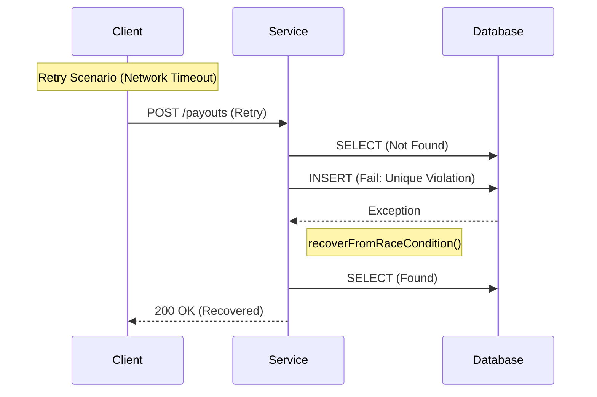

# Payouts Reliability Task

**Goal:** Eliminate "Double Payouts" caused by network timeouts and retries.

## Core Solution
1.  **Database Constraint:** `UNIQUE(client_id, idempotency_key)` in Postgres. This is the **primary safety guarantee**.
2.  **Transparent Recovery:** 
    *   **Check-Then-Act**: Service checks for existing payout first.
    *   **Race Condition Handling**: If concurrent requests bypass the check, the DB constraint triggers a `DataIntegrityViolationException`.
    *   **Recovery**: Service catches the exception, fetches the existing record, and returns `200 OK` (Masking the internal conflict).

## Execution Flow

## Infrastructure (Terraform)
*   **SQS Queue**: Decouples payout processing.
*   **DLQ (Dead Letter Queue)**: Captures messages after **5 retries** (Redrive Policy).
*   **CloudWatch**: Alarm on `ApproximateAgeOfOldestMessage` (> 300s) for consumer lag.

## Verification
*   **Unit Tests**: Mock processing logic.
*   **Integration Tests**:
    *   `PayoutIntegrationTest`: Verify happy path & 200 OK on retry.
    *   `RaceConditionIT`: Simulate `DataIntegrityViolationException` recovery using Mockito.

## Quick Start:
- Run the Application
- H2 DB is already configured to make testing easier.
- Import postman_collection.json to test the Idempotency logic instantly.